<div align="center">




<br/>

<p align="center">
  <em>Software con propósito · GNU/Linux y automatización · Aprendizaje constante</em>
</p>

<br/>

[](https://www.linkedin.com/in/jsravelo/)
&nbsp;
[](mailto:JSantiagoRavelo@gmail.com)
&nbsp;
[](https://jsravelo.com)
&nbsp;
[](https://github.com/JunniorRavelo)
&nbsp;


</div>

---

## Quién soy

```ts
const santiago = {
  perfil      : "Full Stack · DevOps",
  formación   : "Ingeniería de Sistemas (ultimo semestre)",
  ubicación   : "Colombia",
  intereses   : [
    "Cloud e infraestructura como código",
    "APIs, backends y datos",
    "Producto web accesible y mantenible",
  ],
  construyendo: [
    "Next.js y ecosistema React",
    "PHP / WordPress y extensiones",
    "Go y servicios REST",
    "Visualización con datos abiertos",
  ],
  buscando    : ["Colaboraciones en open source", "Proyectos con impacto real"],
};
```

---

## Top repositorios

<div align="center">

| Repositorio | Stars | Forks | Lenguaje |
|:------------|:---:|:---:|:---:|
| [**JunniorRavelo**](https://github.com/JunniorRavelo/JunniorRavelo) <br/> <sub>Perfil de GitHub y portafolio con proyectos personales.</sub> | 1 | 0 | `—` |
| [**recomienda-peli**](https://github.com/JunniorRavelo/recomienda-peli) <br/> <sub>Recomendación de películas según un test de personalidad.</sub> | 0 | 2 | `TypeScript` |
| [**portafolio**](https://github.com/JunniorRavelo/portafolio) <br/> <sub>Portafolio con Next.js 14, Docker y GitHub Actions.</sub> | 0 | 0 | `TypeScript` |
| [**conversa**](https://github.com/JunniorRavelo/conversa) <br/> <sub>Datos abiertos de Colombia: salud, educación, movilidad.</sub> | 0 | 0 | `TypeScript` |
| [**color-detector**](https://github.com/JunniorRavelo/color-detector) <br/> <sub>Detección de color en tiempo real con OpenCV y Flask.</sub> | 0 | 0 | `Python` |
| [**text-to-speech-and-speech-to-text**](https://github.com/JunniorRavelo/text-to-speech-and-speech-to-text) <br/> <sub>UI de voz con la Web Speech API en React.</sub> | 0 | 0 | `TypeScript` |

</div>

---

## Portafolio

> **🎬 [recomienda-peli](https://github.com/JunniorRavelo/recomienda-peli)**
>
> **`TypeScript` `React`**  
> *Test de personalidad que termina en una recomendación de película; idea clara, flujo de usuario y foco en lógica de negocio.*

> **🌐 [portafolio](https://github.com/JunniorRavelo/portafolio)**
>
> **`Next.js 14` `Docker` `GitHub Actions`**  
> *Sitio de presentación profesional con despliegue reproducible y buenas prácticas de CI.*

> **📊 [conversa](https://github.com/JunniorRavelo/conversa) · [conversa-api](https://github.com/JunniorRavelo/conversa-api)**
>
> **`TypeScript` `PHP`**  
> *Exploración de datos abiertos en Colombia (salud, educación, movilidad) con capa de presentación y API.*

> **🎨 [color-detector](https://github.com/JunniorRavelo/color-detector)**
>
> **`Python` `Flask` `OpenCV`**  
> *Cámara en vivo y detección de color: visión por computador aplicada a un caso concreto.*

> **🔊 [text-to-speech-and-speech-to-text](https://github.com/JunniorRavelo/text-to-speech-and-speech-to-text)**
>
> **`React` `Web Speech API`**  
> *Componente de interfaz por voz: síntesis y reconocimiento en el navegador.*

> **🧩 [mi-boton-pdf](https://github.com/JunniorRavelo/mi-boton-pdf)**
>
> **`PHP` `WordPress`**  
> *Plugin para generar botones PDF con enlaces configurables desde el admin de WordPress.*

> 💡 *Los repositorios están abiertos a mejoras: issues y PRs son bienvenidos.*

---

## Estadísticas de GitHub

<div align="center">

|  |  |  |
|:-:|:-:|:-:|

|  |  |
|:-:|:-:|

</div>

---

## Stack tecnológico

<table>
<tbody>

<tr>
<td align="center" colspan="2"><strong>Fuerte práctica</strong></td>
</tr>
<tr>
<td>

 
 
 
 
 
 
 
 
 

</td>
</tr>

<tr>
<td align="center" colspan="2"><strong>Experiencia sólida</strong></td>
</tr>
<tr>
<td>

 
 
 
 
 
 
 
 
 
 
 

</td>
</tr>

<tr>
<td align="center" colspan="2"><strong>Explorando / complemento</strong></td>
</tr>
<tr>
<td>

 
 
 
 
 
 
 

</td>
</tr>

</tbody>
</table>

<p align="center">
  <sub>Entornos de servidor: Ubuntu, Debian, CentOS · Integración GitHub Actions donde aplica.</sub>
</p>

---

<div align="center">

<br/><br/>

<picture>
  <source media="(prefers-color-scheme: dark)" srcset="https://readme-typing-svg.demolab.com?font=Georgia&style=italic&size=18&duration=3500&pause=1200&color=63B3ED&center=true&vCenter=true&width=620&lines=%22Primero%2C+resuelve+el+problema.%22;%22Luego%2C+escribe+el+c%C3%B3digo.%22">
  
</picture>

<sub>— J. Santiago Ravelo</sub>

<br/><br/>


</div>
